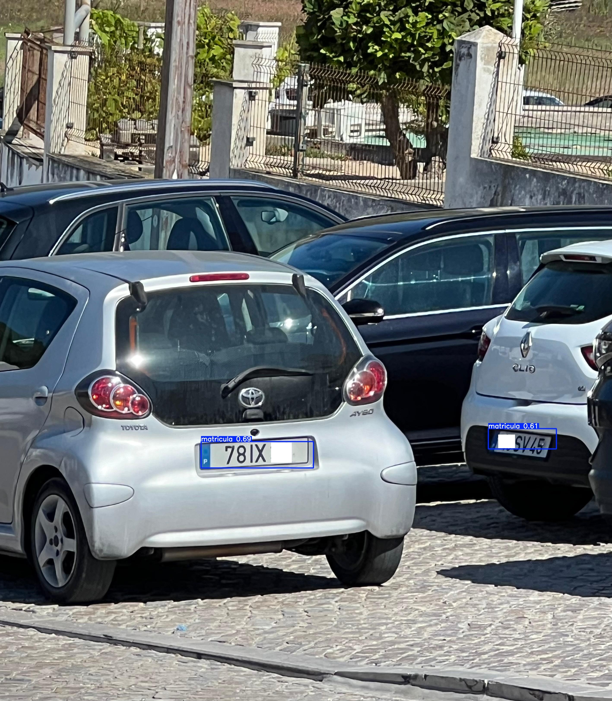

# Car Plate Detection Using YOLOv5 🚘

This project aims to develop a model capable of accurately detecting Portuguese vehicle license plates using the YOLOv5 object detection architecture. The model was trained on manually labeled images, where license plate regions were segmented and annotated.

## 🔧 Technologies Used
- **YOLOv5:** Real-time object detection framework.
- **PyTorch:** Deep learning library used to train and run the model.
- **OpenCV:** For image and video processing.
- **CUDA:** To accelerate training and inference using GPU.

## 🏋️‍♂️ Training
The model was trained on a set of manually labeled images, including 92 photos of vehicles with license plates.

## 📊 Results
After training, the model was validated on a test set of images, achieving accurate license plate detection. Below are some examples:

### Examples:



## 🚀 Next Steps
- Implement OCR to recognize the license plate characters.
- Improve detection accuracy by adding more training data.

## ⚙️ Running the Project

1. Clone the repository and install the required dependencies:

    ```bash
    git clone https://github.com/your_username/CarPlateDetection.git
    cd CarPlateDetection
    pip install -r requirements.txt
    ```

2. Train the model or use the pre-trained weights to run inferences:

    - To test the model with your webcam or images from a folder, modify the script `viewCarPlates.py` accordingly.
    - For running detection using the pre-trained model:

    ```bash
    cd yolov5
    python detect.py --weights runs/train/plate_detector/weights/best.pt --img 640 --conf 0.20 --source ../pics
    ```
